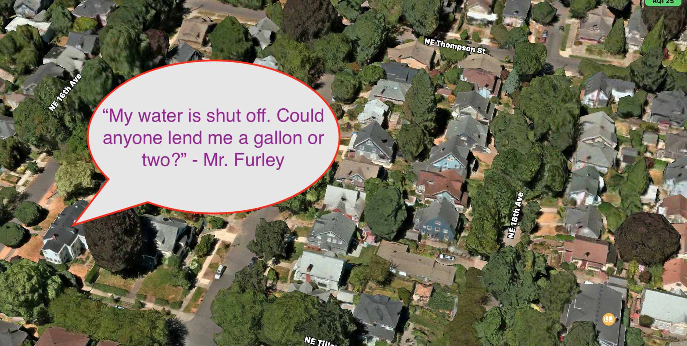
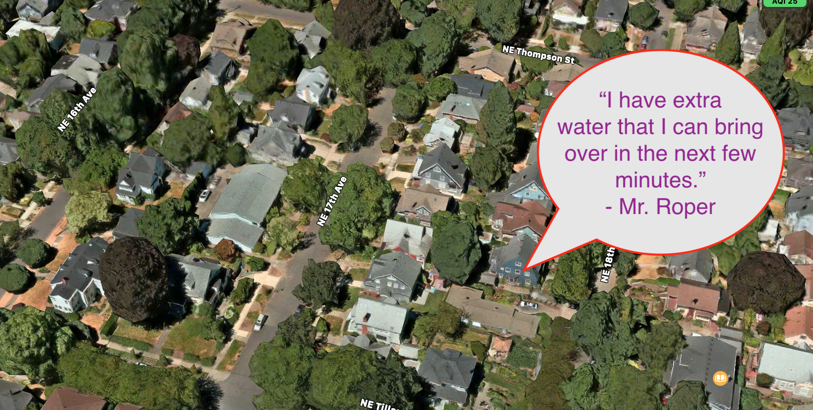
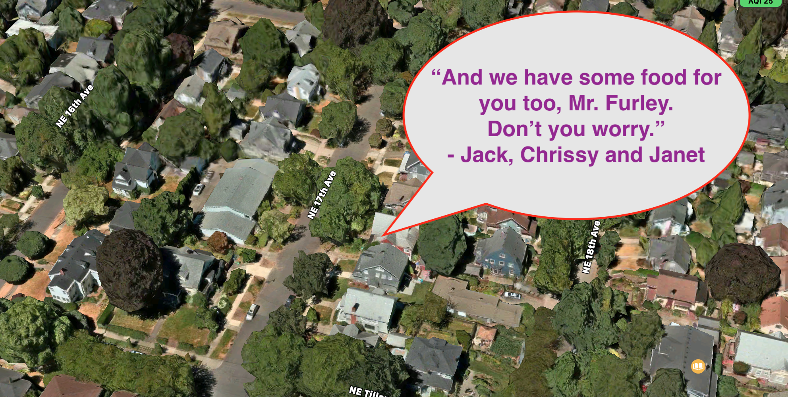

# **Epicodus** School - Capstone Project

  

## _Name of Student_: Thomas Glenn

## _Name of Project_: "LIVELIHOOD" - A Neighborhood Emergency Response Team Application

### Project’s Purpose or Goal: 
* an application to bring neighbors together and serve one another during natural disasters/crises. 

### Execution:
* Users would sign up to offer help in the NERT program (Neighborhood Emergency Response Team) 
* Those in need would post messages to a NERT community board.
* Respondents would offer resources that they could deliver during a disaster. 

### Parameters:
* Each message board would include only those who volunteer.
* The message board is kept private only to participants.
* As a proof of concept, any participant can help any other. Beyond proof of concept, however, ideally, each participant would be limited to serve only those within a one-mile radius (in the interest of safe, walkable delivery).

# "livelihood" - Site map

| Inscription Form |	NERT List	| Neighbor Details |
|:------ |:-------- |:----------- |
| Name	| Neighbor 1 (card)	| Name |
| Address	| Neighbor 2 (card)	| Address |
| Authentication	| Neighbor 3 (card)	| Authentication
| Authorization	| |	Request messages |
| Request messages		| |
| Response messages	| Button: add neighbor (for author only) |	Response messages |
| (id – auto generated by Firestorm) |	Button: view your neighborhood map	| (id – auto generated by Firestorm) |
| |	Button: view neighbor details (clickable neighbor card)	| |
|	| |	Update: |
|	| |		Name (Mr. Farley ->	Mr. Furley) |
|	| |		Address: (#1 sad str. - >	#1 happy str.) |
|	| |		Request: (“one gallon water” ->	Request: “two gallons water”) |
|	| |		Button: update info, return to list |
|	| | |
|	| |		Delete: (“Mr. Furley” -> “ “) |
|	| |		Button: delete function, return to list |
		
# File Tree

use this as reference for markdown:  
https://github.com/adam-p/markdown-here/wiki/Markdown-Cheatsheet

src/  

  `_tests_/reducers`  

    display-state-reducer-test.js

  api/

      APIUtils.js  
      APIUtils.test.js  
      AuthOAPI.js
      NeighborhoodAPI.js  
      ToolsAPI.js 

  components/

      App.css
      App.js
      DeleteConfirm.js
      Footer.js
      Header.js
      NewNeighborForm.js
      Neighbor.js
      NeighborDetails.js
      NeighborList.js
      ReusableForm.js
      UpdateNeighbor.js

  reducers/  

      display-state-reducer.js 
      index.js

App.test.js  
firebase.js  
index.css
index.js  
serviceWorker.js  
setupTest.js  

# "livelihood" - Database:
| Neighbor 1 (ex.) | | 
|:------ |:-------- |
| Id: aQOIM3493498ddVWfn	| Name: 	Mr. Furley | 
| | 	Address:	“#1 NE 16th Street” |
| | Req. Message:	“My water is shut off. Could anyone lend me a gallon or two?” | 
| | Req. Response:	“I can bring some over today.” – Mr. Roper | 
| | Req. Response: "And we have some food for you too, Mr. Furley. Don't you worry." -Jack, Chrissy and Janet

# "livelihood" - Maps:
## Neighbor 1:  Mr. Furley, #1 NE 16th Street

 

## Neighbor 2:  Mr. Roper, #5 NE 17th Street

 

## Neighbor 3:  Jack, Chrissy, and Janet #12 NE 18th Street

  
 

# Minimum features to meet this goal include: 
* Sign-up form, including name and address
* Authentication
* Authorization
* List of participants with skills and tools offered, stored in a NoSQL database using google firebase.
* CRUD functionality in place to Create, Read, Update, Delete members on the stored list.

Tools, frameworks, libraries, APIs, modules and/or other resources to create this MVP:
* REACT with Redux for front end and back end .
* CSS grid for REACT to style pages. 
* NoSQL database using Google Firebase to store form entries.
* Google Maps API, to plot a map of people within a community willing to help. Or
* Google Maps API, for IoT asset tracking - to monitor locations of tools, vehicles, etc. 
* “AuthO” Authorization API, or a simple Identity - Authentication to protect the identities of participants.

_[Javascript](https://developer.mozilla.org/en-US/docs/Web/JavaScript)_

_[CSS](https://en.wikipedia.org/wiki/Cascading_Style_Sheets)_

_[Bootstrap](https://getbootstrap.com/)_

_[HTML](https://developer.mozilla.org/en-US/docs/Web/HTML)_

_[Node.js](https://nodejs.org/en/)_

_[Webpack](https://webpack.js.org/)_

_[Visual Studio Code](https://code.visualstudio.com/)_

_[React](https://reactjs.org/)_

_[Redux](https://redux.js.org/)_

_[Firebase](https://firebase.google.com/)_

_[Stream](https://getstream.io/chat/react-chat/tutorial/)_

_[GoogleMaps](https://cloud.google.com/maps-platform/asset-tracking)_

_[Gatsby](https://www.gatsbyjs.com/)_

hello

Beyond the MVP, I would hope to build this application into a mobile application. If I were to really dream big, I would create an open source platform for this idea, or even propose to a venture firm as a start-up idea. Then, I would hire all my May cohort friends to help build this out. Long term I would love to do the following: 

* Curate a chat room where participants can log service requests and where community members can meet those requests, likely using a platform like STREAM.
* build a tool lending library into the app for people in need to borrow tools and track them using google asset tracking.
* build an attractive user interface using PROCREATE
* investigate applying this application to a mobile platform, like iOS.

Is there anything else you’d like your instructor to know?
* I have changed my mind, choosing now to build this program using React.JS, instead of C# ASP.Net MVC, simply because, long term, I intend to build this project into a mobile iOS appliction. I feel there is more mobile accessibility using REACT. Am I wrong about this? I also feel that, whether I use React.JS or .Net, I am jumping into the "deep end" no matter what. So, I might as well learn as much as I can. 
* I love code.

## Additional Resources