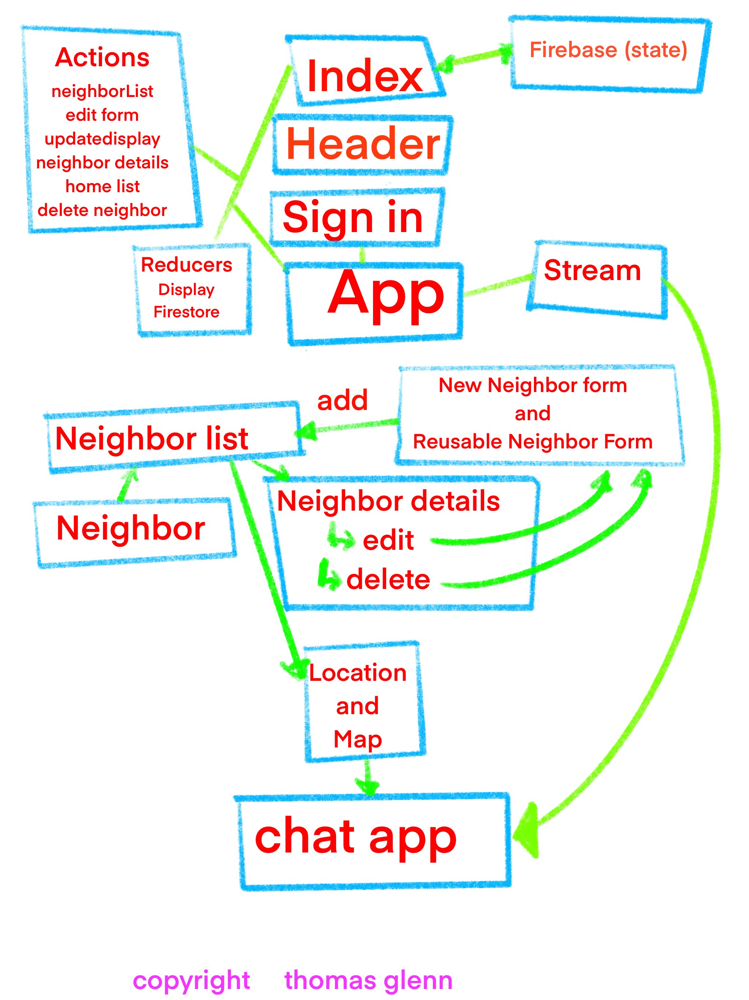

# **Epicodus** School - Capstone Project

  

## _Name of Student_: Thomas Glenn

## _Name of Project_: "LIVELIHOOD" - A Neighborhood Emergency Response Team Application

### Project’s Purpose or Goal: 
* an application to bring neighbors together and serve one another during natural disasters/crises. 

### Execution:
* Volunteers would sign up to offer help in the NERT program (Neighborhood Emergency Response Team) 
* Those in need would post messages to a NERT community board.
* Respondents would offer resources that they could deliver during a disaster. 

### Parameters:
* Each message board would include only those who volunteer.
* The message board is kept private only to participants.
* As a proof of concept, any participant can help any other. Beyond proof of concept, however, ideally, each participant would be limited to serve only those within a one-mile radius (in the interest of safe, walkable delivery).

  

## Installation:
1. Clone Repository - Open local terminal and enter: `git clone https://github.com/thomasglenngit/livelyhood.git`
2. In command line enter: `npm install`
3. In command line enter: `yarn start`

# "livelihood" - Site map

| Inscription Form |	NERT List	| Neighbor Details |
|:------ |:-------- |:----------- |
| Name	| Neighbor 1 (card)	| Name |
| Address	| Neighbor 2 (card)	| Address |
| Authentication	| Neighbor 3 (card)	| Authentication
| Authorization	| |	Request messages |
| Request messages		| |
| Response messages	| Button: add neighbor (for author only) |	Response messages |
| (id – auto generated by Firestorm) |	Button: view your neighborhood map	| (id – auto generated by Firestorm) |
| |	Button: view neighbor details (clickable neighbor card)	| |
|	| |	Update: |
|	| |		Name (Mr. Farley ->	Mr. Furley) |
|	| |		Address: (#1 sad str. - >	#1 happy str.) |
|	| |		Request: (“one gallon water” ->	Request: “two gallons water”) |
|	| |		Button: update info, return to list |
|	| | |
|	| |		Delete: (“Mr. Furley” -> “ “) |
|	| |		Button: delete function, return to list |
		
# File Tree

# "livelihood" - Database:
| Neighbor 1 (ex.) | | 
|:------ |:-------- |
| Id: aQOIM3493498ddVWfn	| Name: 	Mr. Furley | 
| | 	Address:	“#1 NE 16th Street” |
| | 	Email:	“furley@gmale.com” |
| | 	City:	“Portland” |
| | Req. Message:	“My water is shut off. Could anyone lend me a gallon or two?” | 
| | Req. Response:	“I can bring some over today.” – Mr. Roper | 
| | Req. Response: "And we have some food for you too, Mr. Furley. Don't you worry." -Jack, Chrissy and Janet

## Tools, frameworks, libraries, APIs, modules and/or other resources to create this MVP:

_[Javascript](https://developer.mozilla.org/en-US/docs/Web/JavaScript)_

_[CSS](https://en.wikipedia.org/wiki/Cascading_Style_Sheets)_

_[Bootstrap](https://getbootstrap.com/)_

_[HTML](https://developer.mozilla.org/en-US/docs/Web/HTML)_

_[Node.js](https://nodejs.org/en/)_

_[Webpack](https://webpack.js.org/)_

_[Visual Studio Code](https://code.visualstudio.com/)_

_[React](https://reactjs.org/)_

_[Redux](https://redux.js.org/)_

_[Firebase](https://firebase.google.com/)_

_[Stream](https://getstream.io/chat/react-chat/tutorial/)_

_[GoogleMaps](https://cloud.google.com/maps-platform/asset-tracking)_

_[Gatsby](https://www.gatsbyjs.com/)_

hello

## Known Bugs:
1.	Sign-In Authorization: Although this is easy to deploy in a React application using Firebase, for some reason my conditional statements are a tad off and I haven’t yet been able to fix them. 
2.	Cards: Every volunteer entry should appear on a card. For some reason, my React Bootstrap nodes are not working as intended. 
3.	Dysfunctional navbar: ‘Sounds like a great band name, or a millennial hangout, but no. Let’s call it a placeholder for the time being. ‘Also fixable by the weekend.
4.	Improved messaging: I tried to deploy a messaging app that would record message conversations in the Firestorm database. It did not work as planned, so I used Stream. It’s super quick to get going, but I haven’t yet customized it, nor have I yet figured out how to record the messages in Firebase.
5.	Asset Tracker: I went with the standard Google Maps API, though it is my intention to replace it with Google Maps Asset Tracker, so that volunteers could keep track of their tools. If I were to flesh this out as desired, I would include a tool lending library.

